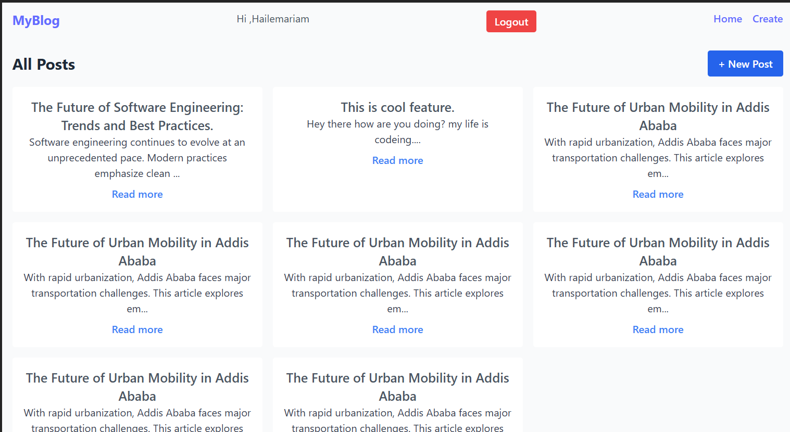

# MERN Blog Application

A full-stack blog application built with  **MongoDB, Express.js, React.js (Vite), and Node.js** . The application allows users to  **register, log in, create/edit/delete blog posts, view categories, and see their profile** . It also supports authentication with JWT.

---

## Features

* User registration and login
* JWT-based authentication
* Protected routes for creating/editing posts
* Create, read, update, delete (CRUD) posts
* View all posts and single post details
* View categories
* Responsive UI with Tailwind CSS
* API service layer for backend communication

---

## Tech Stack

* **Frontend:** React.js, Vite, Tailwind CSS, React Router, Axios, React Hook Form
* **Backend:** Node.js, Express.js, MongoDB, Mongoose
* **Authentication:** JWT (JSON Web Tokens)
* **State Management:** React Context + Hooks

---

## ⚡ Folder Structure

<pre class="overflow-visible!" data-start="1103" data-end="1608">

<code class="whitespace-pre!">client/
 └─ src/
     ├─ assets/
     ├─ components/          # Navbar, ProtectedRoute, etc.
     ├─ context/             # AuthContext.jsx
     ├─ hooks/               # useFetch.js, useAuth.js
     ├─ pages/               # HomePage, PostPage, PostForm, Login, Register
     ├─ services/            # api.js, authService.js, postsService.js, categoriesService.js
     ├─ App.jsx
     ├─ main.jsx
     └─ index.css
server/
 └─ ...                     # Express server, routes, models, controllers
</code>

</pre>

---

## 🚀 Setup Instructions

### 1. Prerequisites

* Node.js v18+
* MongoDB installed and running
* Git installed

---

### 2. Clone Repository

 git clone https://github.com/PLP-MERN-Stack-Development/mern-stack-integration-haile-12-21-23/tree/main

cd merb-

---

### 3. Backend Setup

<pre class="overflow-visible!" data-start="1843" data-end="1876">

<code class="whitespace-pre! language-bash">cd server
npm install
</code>

</pre>

Create a `.env` file with:

<pre class="overflow-visible!" data-start="1906" data-end="1996">

<code class="whitespace-pre!">PORT=5000
MONGO_URI=mongodb://localhost:27017/mern-blog
JWT_SECRET=your_jwt_secret
</code>

</pre>

Start backend server:

<pre class="overflow-visible!" data-start="2021" data-end="2044">

<code class="whitespace-pre! language-bash">npm run dev
</code>

</pre>

---

### 4. Frontend Setup

<pre class="overflow-visible!" data-start="2074" data-end="2107">

<code class="whitespace-pre! language-bash">cd client
npm install
</code>

</pre>

Create a `.env` file:

<pre class="overflow-visible!" data-start="2132" data-end="2183">

<code class="whitespace-pre!">VITE_API_BASE_URL=http://localhost:5000/api
</code>

</pre>

Start frontend server:

<pre class="overflow-visible!" data-start="2209" data-end="2232">

<code class="whitespace-pre! language-bash">npm run dev
</code>

</pre>

Frontend should now be available at `http://localhost:5173` (or the port Vite shows).

---

## 🔗 API Documentation

### Auth Routes

| Method | Endpoint           | Description       | Body                                     | Response                        |
| ------ | ------------------ | ----------------- | ---------------------------------------- | ------------------------------- |
| POST   | /api/auth/register | Register new user | `{ "name", "email", "password" }`      | `{ message: 'User created' }` |
| POST   | /api/auth/login    | Login user        | `{ "email", "password" }`              | `{ token: JWT }`              |
| GET    | /api/auth/profile  | Get current user  | Header:`Authorization: Bearer <token>` | `{ _id, name, email }`        |

### Post Routes

| Method | Endpoint       | Description     | Body                                | Response                   |
| ------ | -------------- | --------------- | ----------------------------------- | -------------------------- |
| GET    | /api/posts     | Get all posts   | None                                | Array of posts             |
| GET    | /api/posts/:id | Get single post | None                                | Post object                |
| POST   | /api/posts     | Create post     | `{ title, content, category }`    | Created post object        |
| PUT    | /api/posts/:id | Update post     | `{ title?, content?, category? }` | Updated post object        |
| DELETE | /api/posts/:id | Delete post     | None                                | `{ message: 'Deleted' }` |

### Category Routes

| Method | Endpoint        | Description        | Body         | Response                |
| ------ | --------------- | ------------------ | ------------ | ----------------------- |
| GET    | /api/categories | Get all categories | None         | Array of categories     |
| POST   | /api/categories | Create category    | `{ name }` | Created category object |

---

## 🧑‍💻 Authentication Flow

1. User registers → receives success message
2. User logs in → receives JWT token
3. Token stored in `localStorage` and attached to Axios requests
4. User profile fetched using `/auth/profile`
5. Protected routes prevent access if not logged in

---

## 🖼️ Screenshots

---

## ✅ Submission Notes
